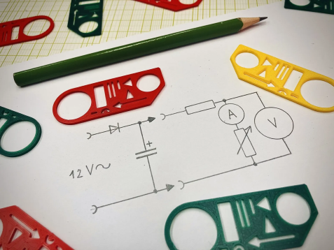
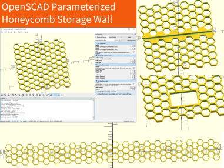
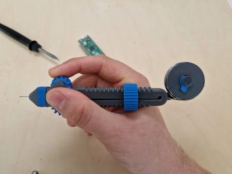

# 3D Printing

## Template For Electrical Diagrams by Jan Štech | Download free STL model | Printables.com

<https://www.printables.com/model/759378-template-for-electrical-diagrams>

Miniature template for drawing electrical schematics.

## Printy Pipes Construction Toy by 3D Printy

<https://www.printables.com/model/493170>

Easier to print, easier to assemble, and stronger than ever

Youtube Playlist of the 3D Printy :

<https://m.youtube.com/playlist?list=PLQdNwKpqG_m_o6InJTuDfWEZvpsQt-29W>

### [3D printy Profile on Thingiverse](https://www.thingiverse.com/3d-printy/designs)

Hobbyist maker & 3D printing geek with a focus on puzzles and fun mechanisms.

<https://www.thingiverse.com/3d-printy/designs>

## Honeycomb storage wall by RostaP

<https://www.printables.com/model/152592-honeycomb-storage-wall>

Wall for attaching hooks and holders for your tools. You will create the wall according to your own idea.

## OpenSCAD Parameterized Honeycomb Storage Wall by Wireheadarts

<https://www.printables.com/model/163200-openscad-parameterized-honeycomb-storage-wall>

The Honeycomb Storage Wall, but parameterized in OpenSCAD for your convenience.

## Solder Scroll - Ergonomic, Adjustable Solder Tool by Victor

<https://www.printables.com/model/843353-solder-scroll-ergonomic-adjustable-solder-tool>

The Solder Scroll allows you to easily add solder of different diameters.

## Foam Board - Hiding joins

<https://www.youtube.com/watch?v=S_nyV1C0cYM>

## [LED Hexagon Wall Clock](https://www.instructables.com/LED-Hexagon-Wall-Clock/)

<https://www.instructables.com/LED-Hexagon-Wall-Clock/>

## [Crossbow (compliant mechanism ) 3D printed](https://www.thingiverse.com/thing:6654828)

<https://www.thingiverse.com/thing:6654828>

----
<!-- Footer Begins Here -->
## Links

- [Back to Root Document](../README.md)
