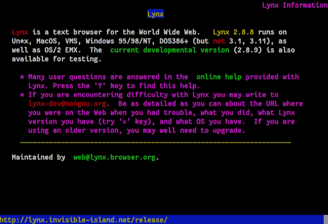

# Lynx is a text browser for the World Wide Web.

Home Page: <https://lynx.browser.org/>

Install `sudo apt-get install lynx`

Very small and compact no trackers or adds or images.

## Lynx Browser: The Land That Time Revived 

<https://popzazzle.blogspot.com/2022/06/lynx-browser-land-that-time-revived.html>

Very relevant in the time where trackers add adds and all things trouble are everywhere.

----
<!-- Footer Begins Here -->
## Links

- [Back to Root Document](../README.md)
