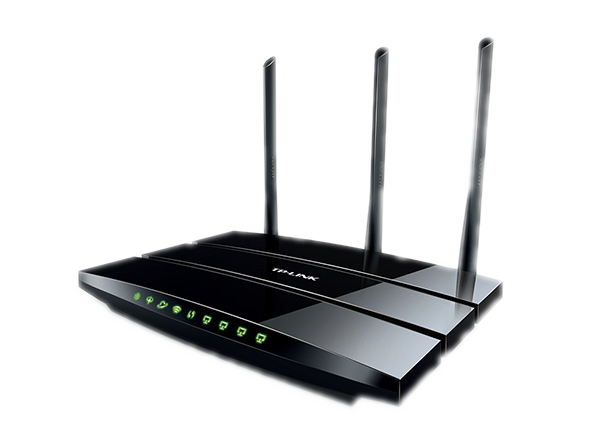

# Mods to the TP-Link W8970 Router

[](./td-w8970-v1.png)


Serial Terminal and Fixes for OpenWrt Latest
on TP-Link W8970

<https://openwrt.org/toh/tp-link/td-w8970_v1>

[PDF Document](./OpenWRT-TP-Link-TD-W8970_v1.pdf) for the same.

### Command Sequence

1. Download the setup the TFTP Server, Also Download the Bin File Image for
sys upgrade:

	<https://openwrt.org/toh/tp-link/td-w8970_v1#installation>

	Go for the "Firmware OpenWrt Upgrade URL"
	<https://downloads.openwrt.org/releases/23.05.5/targets/lantiq/xrx200/openwrt-23.05.5-lantiq-xrx200-tplink_tdw8970-squashfs-sysupgrade.bin>

2. Solder Wires to the Serial Port

	<https://openwrt.org/toh/tp-link/td-w8970_v1#opening_the_case>

	More info on location of the Pins here.

3. Connect Serial port to PC and setup Serial Terminal

4. Entering Boot terminal: As soo as the system boots keep holding
`t` key till you get to a prompt.

5. Configure you Ethernet network with:

	```
	IP 192.168.1.2
	SUB 255.255.255.0
	GW 192.168.1.1
	```

	As static configuration. Connect Ethernet between PC and router.
	Disable Wireless for now.

6. Copy the .bin file to the TFTP Server Folder `/var/lib/tftpboot`

7. Restart the TFTP Server

8. Type the Configuration commands in the Serial Terminal

	a. Set the IP Address for Router

	```sh
	setenv ipaddr 192.168.1.1
	```

	b. Set the IP Address of the PC

	```sh
	setenv serverip 192.168.1.2
	```

	c. Set Board Type

	```sh
	setenv bootargs 'board=WD8970'
	```

	d. Set the Image to be downloaded from TFTP

	```sh
	tftpboot 0x81000000 openwrt-23.05.5-lantiq-xrx200-tplink_tdw8970-squashfs-sysupgrade.bin
	```

	This would take some time and will print the size of the file download:

	```
	72025b
	```

	e. Erase the RootFS area

	```sh
	sf erase 0x20000 0x7a0000
	```

	This would take some time to finish. Please wait.

	f. Write the Image from the Ram to Flash

	```
	sf write 0x81000000 0x20000 0x$(filesize)
	```
	This again will take some time to finish. Don't worry about the `filesize`
	part it would be automatically be taken care.

	g. Finally Reset the Router with new firmware

	```sh
	reset
	```

9. Now Disconnect the cable from PC and reset the Ethernet configuration
to a DHCP type to get the IP from Router.


You can now login to the OpenWrt console using `192.168.1.1` on web page.
The login name is `root` without any password at the beginning.

----
<!-- Footer Begins Here -->
## Links

- [Back to Root Document](../README.md)


