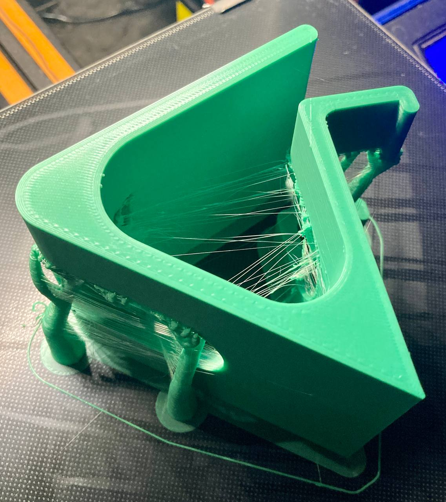
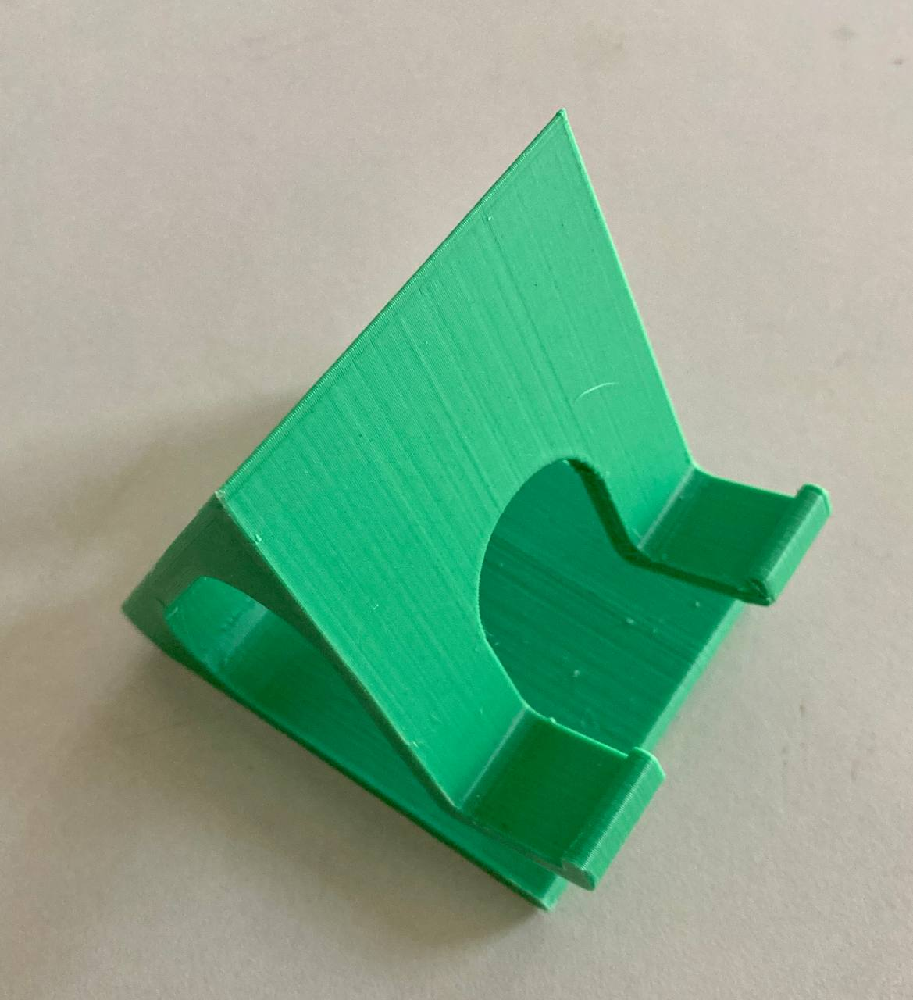
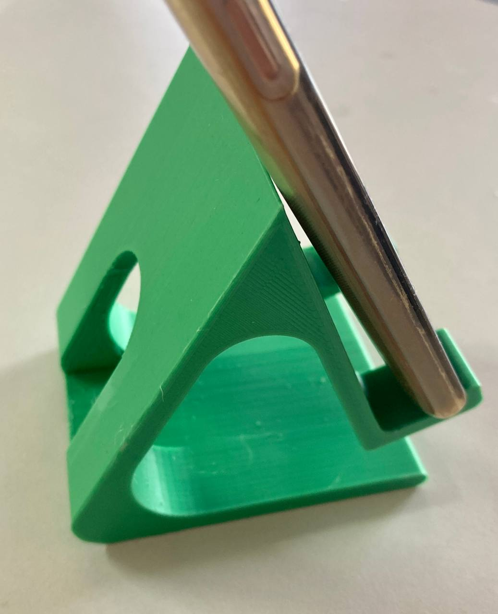
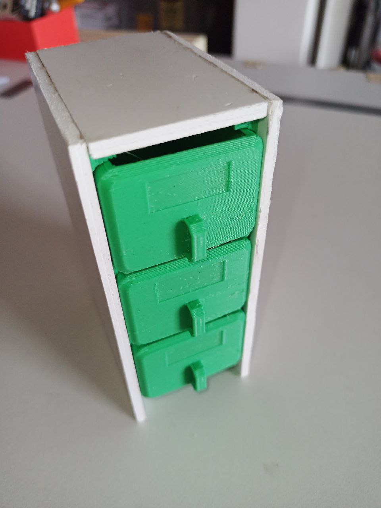
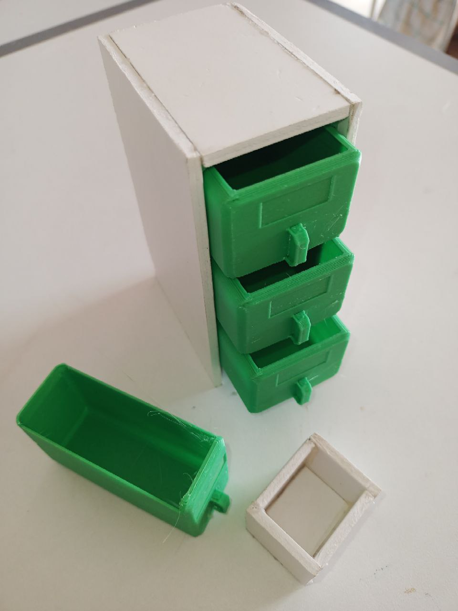
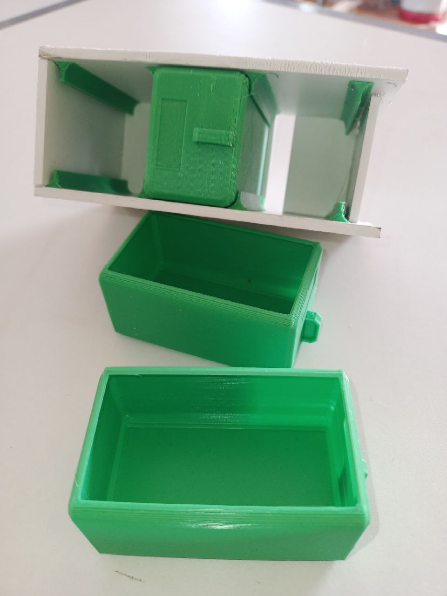
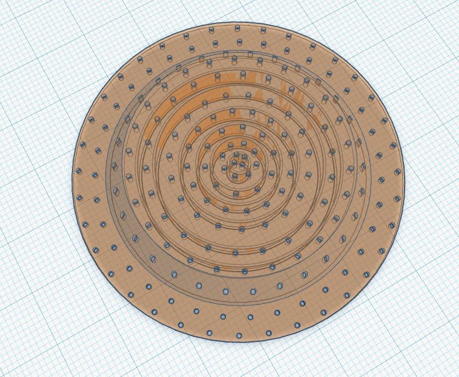

# Boseji's Thoughts

A chronology of the original Boseji's Thoughts channel over Telegram that was shut down.

## Dec 1st 2023

> Inside yourself or outside, you never have to change what you see, only the way you see it.
>
> **Thaddeus Golas**
>

## Dec 2nd 2023

> There is hope in dreams, imagination, and in the courage of those who wish to make those dreams a reality.
>
> **Jonas Salk**
>

## Dec 3rd 2023

Another Phone Stand on the Printer bed

All cleaned up Phone Stand

Put to good use. Just look at that spacious rest of mobile.

## Dec 5th 2023

Small component Cabinet. A beautiful mix of 3D printing and Foam board Art.

## Dec 6th, 2023

> There is a spectrum even in the gray, not every thing needs colors or brightness. It's always a brave thought to move away from the rigidity and embrace fluidity as eternal.
>
> **boseji**

## Dec 9th, 2023

> Belief bestows blessings upon those, who enamor the essence of persistence towards ones own destiny.
>
> **boseji**

## Dec 10th, 2023

> Don't utter - I can't or I won't.
>
> It's cowardice and depreciating.
>
> Instead question - How can I ?, or How do I ?.
>
> You have learned the secret to be wealth and wisdom.
>
> **Rich Dad Poor Dad (Robert Kiyosaki)**

## Dec 15th, 2023

<https://fs.blog/an-antifragile-way-of-life/>

> ### 10 Principles to Live an Antifragile Life
> An antifragile way of life is all about finding a way to gain from the inevitable disorder of life. Here are ten principles that will help you live an antifragile life.
>

## Dec 16th, 2023

> Words are your own prison, words are your binds.
Choose them carefully; use them with reflection.
>
> Know that they can free you or, heal a scared soul.
>
> **boseji**
>

## Dec 30th, 2023

> Solve issues when the time comes,
Not before starting.
Focus on results, rather than Tech used.
>
> **A Lazy programmer**

## Jan 2nd, 2024

> Expensive Frugality: Being penny wise and pound foolish.
>
> Price is what you pay,
>
> Value is what you get.
>
> **Warren Buffet**

<https://www.newtraderu.com/2023/12/31/warren-buffett-10-things-poor-people-waste-money-on-financial-independence-financial-education/>

> ### Warren Buffett: 10 Things Poor People Waste Money On (Financial Independence, Financial Education)
>  When thinking about financial independence and financial education, few names resonate as profoundly as Warren Buffet.
>

**[PDF](./Thoughts/Warren-Buffett_10-Things-Waste-Money.pdf)** of the above link.

## Jan 3rd, 2024

> If you don’t find a way to make money while you sleep, you will work until you die.
>
> **Warren Buffet**

## Jan 4th, 2024

> The strongest principle of growth lies in the human choice.
>
> **George Eliot ( Daniel Deronda )**

---

## Jan 11th, 2024

> Actively ignore the subject of your dislike !
> You can't change any one other than yourself.
>
> **an overzealous parent.**

## Jan 17th, 2024

Good refresher on AC Root Mean Square Values (RMS)

> **Understanding RMS Values in AC Circuits √2  ? | Voltage | Current**
> 🔍 Dive deep into the world of AC circuits with our comprehensive tutorial! In this video, we demystify RMS values
>

<https://www.youtube.com/watch?v=3Et8xqC-764>

## Jan 19th, 2024

> Silence is the divine secret.
>
> **Bhagwat Gita**

## Jan 20th, 2024

> One can't be totally isolated from influences.
> But, one should always peruse sound reasoning and healthy paranoia.
>
> **boseji**

## Jan 21st, 2024

Few minutes of peace and harmony any where any time.

> **Daily Calm | 10 Minute Mindfulness Meditation | Be Present**
> Tamara Levitt guides this 10 minute Daily Calm mindfulness meditation to powerfully restore and re-connect with the present.

<https://www.youtube.com/watch?v=ZToicYcHIOU>

## Jan 22nd, 2024

> **LIVE - Consecration Ceremony of Ram Mandir | Ayodhya Dham | 22nd January 2024**
> Join us for an unprecedented moment in history – the Ram Temple consecration ceremony in Ayodhya, Uttar Pradesh.

<https://www.youtube.com/watch?v=c1Cnoc3qvG0>

## Jan 23rd, 2024

> **Construction of Shri Ram Janmabhoomi Temple (Off. 3D Movie) by Shri Ram Janmabhoomi Teertha Kshetra**
> The Construction of Grand and Divine Shri Ram Janmabhoomi Temple  is going on in full swing.

<https://www.youtube.com/watch?v=lyFazCoV7UI>

## Jan 23rd, 2024

> No Real change in history has ever been achieved by discussions.
>
> Freedom is not given - it is taken.
>
> **Netaji Subhash Chandra Bose**
> ***(Leaving INC, 1938)***

## Jan 27th, 2024

[Indian Knowledge Systems 2024 Calendar](Thoughts/IKS_IITKGP_Calendar_2024-2_231216_131702.pdf).

May sellers did not give us this but its easy to get a color printout of this.

## Jan 28th, 2024

> Whether something has value or not in your life, you need to decide that for yourself.
>
> Don't let others intervene, unless its wisdom.
>
> **A worried Manager**

## Jan 29th, 2024

> Solve the issues when the time comes,
>
> Not before starting project.
>
> Focus on results, rather than on tech used.
>
> **boseji (Resolution of 2024)**

## Feb 3rd, 2024

A special Sieve:

## Feb 5, 2024

> If you don't separate yourself from distractions,
>
> your distractions will separate you from your goals.
>
> **Steve Harvey**

----
<!-- Footer Begins Here -->
## Links

- [Back to Root Document](./README.md)
